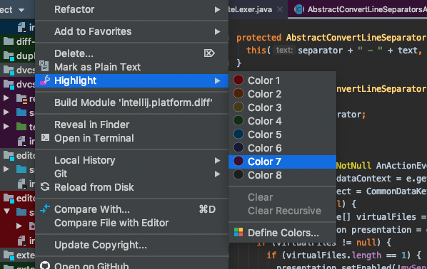
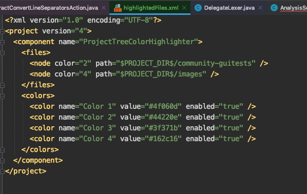

# ProjectTree Color Highlighter
####  Plugin for Jetbrains IDEs. Highlights your project files and folders in colors.

When you are working on a large complex project you may need to highlight
some of its parts in different colors.

Previously, there was only one way to do this:
create a scope, specify its name and filename pattern, then add a color
and attach it to the created scope, then click `Ok` and `Apply` 
to see how it looks now. If the color doesn't fit, double-click it, select a new color,
click `OK` and `Apply` again to see the changes. If the color doesn't fit again -
repeat until it fits.
This is a rather inconvenient way (and takes a lot of time).

**ProjectTree Color Highlighter** was made to get rid of this inconvenience. 
Highlight your files and folders with ease using the context menu. Adjust the colors 
using the color picker, get an instant preview of the project tree and editor tabs 
while adjusting.

All settings are persistently stored in the `.idea/highlightedFiles.xml`,
so you can read and change it externally, clone or copy-paste to other projects, etc.
(This allows you to create various project boilerplates with predefined highlighting settings.)

Enjoy and write a lot of awesome code!
